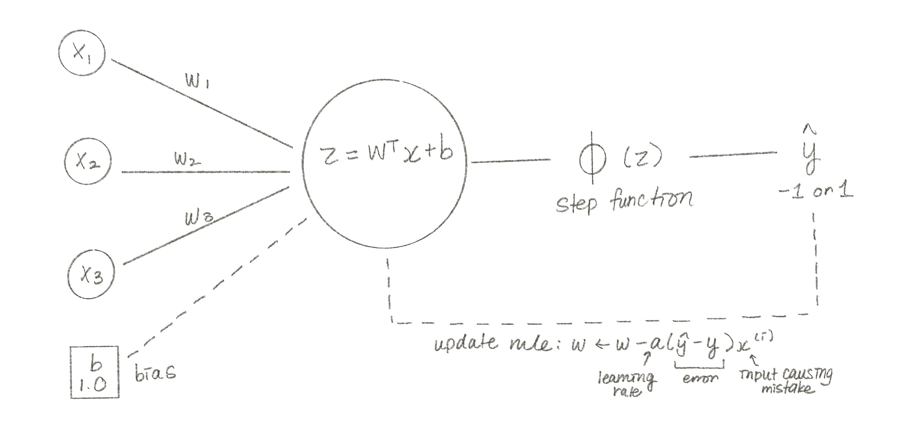

# A) The Perceptron

## What is the Perceptron?

The Perceptron is the oldest machine learning algorithm, invented by Frank 
Rosenblatt in 1958. It is inspired by how a single biological neuron works — 
it receives signals, and if the combined signal is strong enough, it fires.

It is a **binary classifier** — it draws a straight line between two groups 
and asks: which side of the line does this data point fall on?

## My Diagram

## The Math

**Step 1 — Preactivation:**

z = wᵀx + b

**Step 2 — Activation (step function):**

Φ(z) = 1  if z > 0
Φ(z) = -1 if z ≤ 0

**Step 3 — Update Rule:**

w ← w - α(ŷ - y) · x
b ← b - α(ŷ - y)

Where:
- α = learning rate (how big each correction step is)
- ŷ = predicted label
- y = true label
- x = input that caused the mistake

## Dataset

**AKC Dog Breeds** — 277 breeds with physical and behavioral traits  
**Question:** Can we predict whether a dog breed has a long or short lifespan?  
**Label:** 1 = long-lived (≥ 14 years), -1 = short-lived (< 14 years)

## Files
- `The-Perceptron.ipynb` — full notebook with data exploration, training and evaluation
- `data/Dog_Breed.csv` — the dataset
- `perceptron_model.jpg` — hand-drawn diagram of the Perceptron
